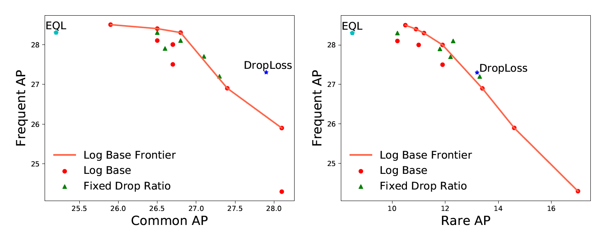

# [AAAI 2021]DropLoss for Long-Tail Instance Segmentation

[AAAI 2021] DropLoss for Long-Tail Instance Segmentation  
Ting-I Hsieh*, Esther Robb*, Hwann-Tzong Chen, Jia-Bin Huang.  
Association for the Advancement of Artificial Intelligence (AAAI), 2021



Figure: Measuring the performance tradeoff. Comparison
between rare, common, and frequent categories AP for baselines
and our method. We visualize the tradeoff for ‘common
vs. frequent’ and ‘rare vs. frequent’as a Pareto frontier, where
the top-right position indicates an ideal tradeoff between objectives.
DropLoss achieves an improved tradeoff between
object categories, resulting in higher overall AP.

This project is a pytorch implementation of *DropLoss for Long-Tail Instance Segmentation*. DropLoss improves long-tail instance segmentation by adaptively removing discouraging gradients to infrequent classes. A majority of the code is modified from [facebookresearch/detectron2](https://github.com/facebookresearch/detectron2) and [tztztztztz/eql.detectron2](https://github.com/tztztztztz/eql.detectron2).  


### Progress

- [x] Training code.
- [x] Evaluation code.
- [x] LVIS v1.0 datasets.
- [ ] Provide checkpoint model.


## Installation
### Requirements
- Linux or macOS with Python = 3.7
- PyTorch = 1.4 and [torchvision](https://github.com/pytorch/vision/) that matches the PyTorch installation.
  Install them together at [pytorch.org](https://pytorch.org) to make sure of this
- OpenCV (optional but needed for demos and visualization)

### Build Detectron2 from Source
gcc & g++ ≥ 5 are required. [ninja](https://ninja-build.org/) is recommended for faster build.

After installing them, run:

```
python -m pip install 'git+https://github.com/facebookresearch/detectron2.git'
# (add --user if you don't have permission)

# Or, to install it from a local clone:
git clone https://github.com/facebookresearch/detectron2.git
python -m pip install -e detectron2


# Or if you are on macOS
CC=clang CXX=clang++ ARCHFLAGS="-arch x86_64" python -m pip install ......
```

Remove the latest fvcore package and install an older version:

```
pip uninstall fvcore
pip install fvcore==0.1.1.post200513
```

## LVIS Dataset

Following the instructions of [README.md](https://github.com/facebookresearch/detectron2/blob/master/datasets/README.md) to set up the LVIS dataset.


## Training

To train a model with 8 GPUs run:

```
cd /path/to/detectron2/projects/DropLoss
python train_net.py --config-file configs/droploss_mask_rcnn_R_50_FPN_1x.yaml --num-gpus 8
```

## Evaluation

Model evaluation can be done similarly:

```
cd /path/to/detectron2/projects/DropLoss
python train_net.py --config-file configs/droploss_mask_rcnn_R_50_FPN_1x.yaml --eval-only MODEL.WEIGHTS /path/to/model_checkpoint
```


## <a name="CitingDropLoss"></a>Citing DropLoss

If you use DropLoss, please use the following BibTeX entry.

```BibTeX
@inproceedings{DBLP:conf/aaai/Ting21,
  author 	= {Hsieh, Ting-I and Esther Robb and Chen, Hwann-Tzong and Huang, Jia-Bin},
  title     = {DropLoss for Long-Tail Instance Segmentation},
  booktitle = {Proceedings of the Workshop on Artificial Intelligence Safety 2021
               (SafeAI 2021) co-located with the Thirty-Fifth {AAAI} Conference on
               Artificial Intelligence {(AAAI} 2021), Virtual, February 8, 2021},
  year      = {2021}
  }
```
